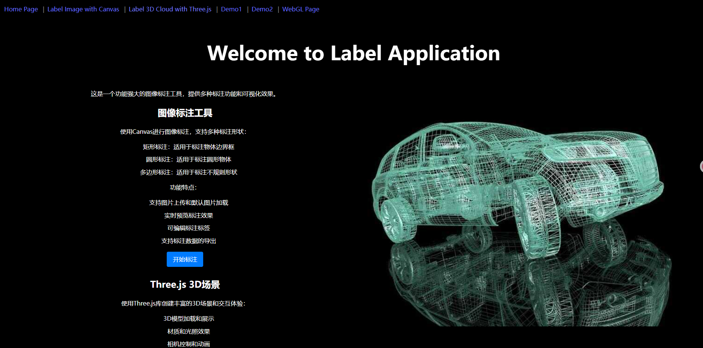
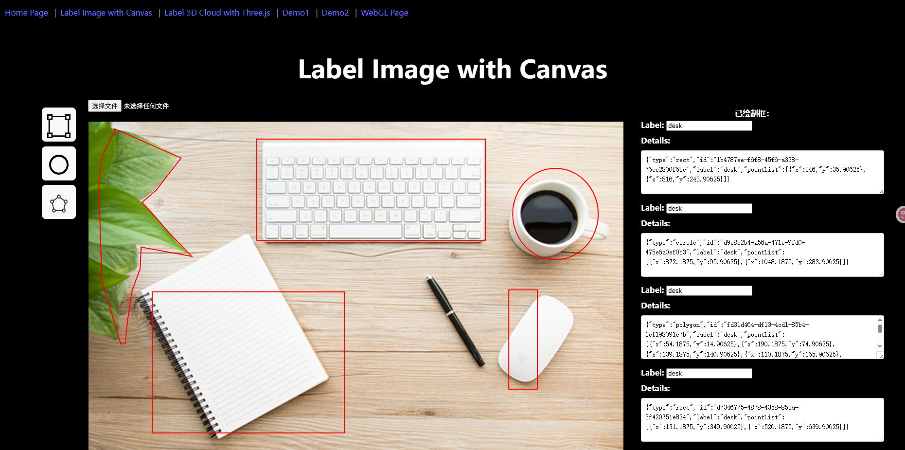
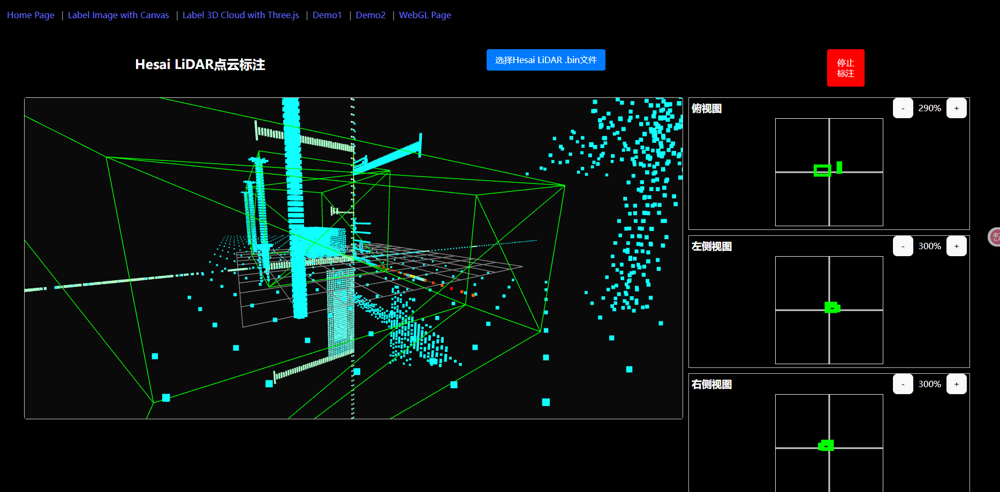

## 一、项目介绍

- 1、这是一个Web标注App, 采用`React`开发的。项目部署在
  - [`github`地址](https://github.com/duduc123****)
- 2、提供`图片标注`功能，使用canvas实现。用户可以对图片中的物理 标注矩形，圆形以及不规则图形。
- 3、提供`3D点云`数据渲染和标注功能， 采用的是three.js。打开点云文件后，用户可以对点云中的点进行标注，标注后可以保存标注结果。

## 二、使用项目

- 1、npm install

- 2、npm run dev

- 3、项目运行在 http://localhost:5173/ 
以下是项目运行后的截图：

