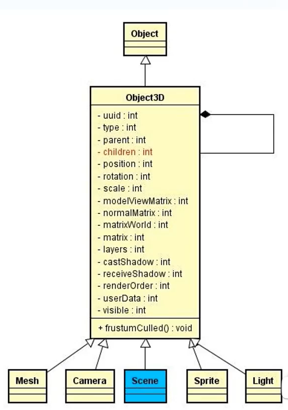

# 1.three.js 核心知识 -7h

doc: https://threejs.org/docs/index.html#api/zh/core/Object3D 
  场景，摄像机， 渲染器， 几何图形，材质
  网格， GUI， 全景图，光线折射， 性能
  定义： 是WebGL引擎，基于JavaScript， 可直接运行GPU驱动游戏与图形驱动应用与浏览器。 其库提供了大量特性与API以绘制3D场景。
  WebGL： Web图形库， 一组浏览器的API， 可以无需其他插件，独立渲染3D场景。
  ## 1.1 three.js 三要素
    - 1 场景： 场景是所有物体和光源的容器， 用来放置物体， 光源， 相机等。
        - 场景： new THREE.Scene()
        - 添加物体： scene.add(mesh)
        - 添加光源： scene.add(light)
        - 添加相机： scene.add(camera)
    - 2 相机： 相机决定了渲染什么， 从什么角度渲染， 透视相机， 正交相机。
        - 透视相机： new THREE.PerspectiveCamera(fov, aspect, near, far)
              - 参数fov： 视野范围，常用值 45~75，值越大视野越广
              - 参数aspect： 宽高比， 画布宽高比， 否则画面变形，常用值如 0.1
              - 参数near： 距离相机最近的可见距离，距离小于该值的物体不会被渲染。常用值如 0.1。
              - 参数far： 距离相机最远的可见距离，距离大于该值的物体不会被渲染。常用值如 1000。
        - 正交相机： new THREE.OrthographicCamera(left, right, top, bottom, near, far)
              - 参数left： 左平面距离相机位置的距离
              - 参数right： 右平面距离相机位置的距离
              - 参数top： 上平面距离相机位置的距离
              - 参数bottom： 下平面距离相机位置的距离
              - 参数near： 距离相机最近的可见距离，距离小于该值的物体不会被渲染。常用值如 0.1。
              - 参数far： 距离相机最远的可见距离，距离大于该值的物体不会被渲染。常用值如 1000。        
              - 正交相机和透视相机的主要区别在于， 正交相机渲染的物体大小不会随距离变化， 而透视相机渲染的物体大小会随距离变化。
    
    - 3 渲染器： 渲染器决定了渲染的结果输出到什么位置， 渲染器渲染场景和相机看到的内容。
        - 渲染器： new THREE.WebGLRenderer()
        - renderer.setSize()： 设置渲染器的大小， 画布大小
        - renderer.render(sceneRef, cameraRef)： 渲染场景和相机看到的内容
  ## 1.2 轨道控制器
    目的：使摄像机围绕目标进行轨道运动
      - 单独引入 OrbitControls 
      - 创建轨道控制器
        - controls.current = new OrbitControls(cameraRef.current, rendererRef.current
         domElement);
        - controls.current.enableDamping = true; // 启用阻尼（惯性），必须在动画循环中调用 update()
        - controls.current.dampingFactor = 0.05; // 阻尼惯性系数，值越小惯性越大，默认值0.05
        - controls.current.autoRotate = true; // 启用自动旋转
        - controls.current.autoRotateSpeed = 2.0; // 自动旋转速度，相当于在60fps时每旋转一周需要30秒。
        - controls.current.maxPolarAngle = Math.PI / 2; // 垂直旋转的最大角度，0到Math.PI之间，限制上下旋转范围，防止翻转
        - controls.current.minPolarAngle = 0; // 垂直旋转的最小角度，0到Math.PI之间，限制上下旋转范围，上面是0度，下面是90度
        - controls.current.maxAzimuthAngle = 1.5 * Math.PI; // 水平旋转的最大角度, 范围是看到后面和左面， 右面那面看不到
        - controls.current.minAzimuthAngle = 0.5 * Math.PI; // 水平旋转的最小角度
        - controls.current.minDistance = 2; // 最小缩放距离
        - controls.current.maxDistance = 20; // 最大缩放距离
        controls.update()
      - 
        }
  ## 1.3 坐标轴: 
    - 添加坐标轴辅助器 const axesHelper = new THREE.AxesHelper(5); // 参数表示轴线的长度
    - scene.add(axesHelper);
  ## 1.4 场景适配：resize
    - cameraRef.current.aspect = window.innerWidth / window.innerHeight;
    - cameraRef.current.updateProjectionMatrix();// 更新相机投影矩阵
    - rendererRef.current.setSize(window.innerWidth, window.innerHeight);

  ## 1.5 物体： 立方里创建 Mesh  
    - 1.创建图形，立方缓冲几何体，参数为宽、高、深
      const geometry = new THREE.BoxGeometry(1, 1, 1); 
    - 2.创建材质，基础材质-网格基础材质（线，面穿颜色描绘表面），参数为颜色
      const material = new THREE.MeshBasicMaterial({ color: 0x00ff00 }); 
    - 3.创建网格，传入图形和材质
      const cube = new THREE.Mesh(geometry, material);
    - 4.将立方体添加到场景中
      sceneRef.current.add(cube); // 创建网格物理对象， 传入图形和材质将立方体添加到场景中
    - 为立方里的每一个面设置不同的颜色
      const colorArr = ['red', 'blue', 'green', 'yellow', 'orange', 'pink'];
      const materialsArr = colorArr.map((colorStr) => {
        return new THREE.MeshBasicMaterial({ color: colorStr });
      });
      const cube = new THREE.Mesh(geometry, materialsArr); // 把材质数组传入 mesh 构造新的物理
      sceneRef.current.add(cube);
      })
  ## 1.6 循环创建: requestAnimationFrame
      在渲染循环中更新场景渲染
        - requestAnimationFrame(renderLoop)
        - renderLoop() {
          controls.update()// 手动JS更新过摄像机的信息， 必须调用轨道控制器update 方法
          renderer.render(sceneRef, cameraRef)

# 2.three.js 进阶知识 -9h
  贴图， 粗糙度， 金属度，物理材质， 模型
  坐标， 光源， 阴影， gsap, 精灵物理
  项目： 汽车展厅
# 3.着色器原理 8h

# 标注软件参考
## 1.basicFinder 参考产品
  - link: https://www.basicfinder.com/services/
  - 数据堂： https://www.datatang.com/platform?txbz2

## 2.标注软件参考
  - link: https://www.zeplin.com/

## 3.标注数据集参考
  - 美团： https://developer.meituan.com/isv/announcement/detail?dockey=anno-all&id=announcement-4574 

## 点云基础知识：
  - three API doc: https://threejs.org/docs/#api/zh/core/Raycaster 
  - link 当前端遇到了自动驾驶: https://juejin.cn/post/7422338076528181258 

  视屏讲解： https://www.bilibili.com/video/BV1HPYQz7Ed2/?spm_id_from=333.788.player.switch&vd_source=50a0e952162bc25deee2d84daf559b85&p=4